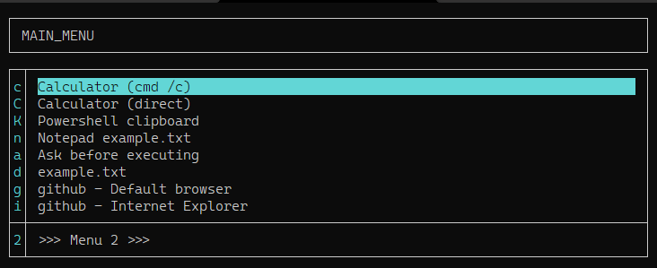

# 'Jelovnik'*


## Earth's simplest Powershell 7 console menu system.. maybe?



## WHAT

Jelovnik is fast, simple, "less than 100 lines of code" keyboard-warrior's open-source menu system for rapid-development of console menus. All you have to do is write few CSV lines to a file and enjoy.


## WHY

I needed a menu system which will allow me to quickly add/remove menu items without wondering around through numerous lines of code or risking to break perfectly functioning menu by doing a small change. I was using otherwise uberpowerful AutoHotKey for that purpose, but for some reason I never managed to get used to AHK's menu system.


## WHERE

Powershell 7 console, Windows. Could be made compatible with Powershell 5, but IMHO every Powershell keyboard warrior should have v.7 anyway, so...


## HOW

"System" consists of a script and at least one menu file. Menu file contains info about hot-keys and associated commands. It may be convenient to assign a Windows or Autohotkey shortcut key to start menu.


### Run

`C:\Program Files\PowerShell\7\pwsh.exe -file jelovnik.ps1 main_menu.csv`

After pressing a hot-key, script will execute an assigned command and exit (unless the command is "LoadMenu" in which case it will open next menu). This behavior can be changed run a command and to stay in the same menu ("loop") until ESC is pressed; see below.


### Menu-file

"Menu file" is a simple text, comma separated file (actually, pipe separated, "|") of any name with .CSV extension.


#### Limits

You can have as many menu files as you wish.
You can create as many levels of menus as needed.
There must be at least one item in a menu file.
There can be 62 items in a single menu file as hotkeys are [a..z], [A..Z] and [0..9].
`Left arrow` (go back in history of submenus) works only with one level.


#### Exit after execution or stay in menu?

Currently, script ends after a hot-key is pressed and command executed. Behavior can be changed to "loop until ESC is pressed" by changing this line:

`Default {	Start-Process $script:Jelovnik[$j].Command.Trim() -ArgumentList $script:Jelovnik[$j].Parameters.Trim(); EXIT }`

to this:

`Default {	Start-Process $script:Jelovnik[$j].Command.Trim() -ArgumentList $script:Jelovnik[$j].Parameters.Trim() }`

(in short: remove `; EXIT` ). Now script will run a command and stay in the current menu file. Exit by pressing "ESC".


#### Menu-file format

CSV files have four fields:

|Field     |Description                 |
|----------|----------------------------|
|Key       |Menu hot-key                |
|Title     |Title of an item in menu    |
|Command   |Command to execute          |
|Parameters|Arguments for a command     |

_("Key" is case-sensitive character, or number)_


#### Menu example with a "walking explanation"

Example row from a menu file:

```c|Calculator|cmd|/c calc.exe```

|Items      |Description                         |
|-----------|------------------------------------|
|c          |When user presses "c" on keyboard.. |
|Calculator |..in a line titled "Calculator"..   |
|cmd        |..execute this command..            |
|/c calc.exe|..with these arguments              |


#### Special items in menu-files

There are several special keys / commands in menu-file:

+ Command `<LOADMENU>` ... loads another menu-file
+ Command `<ASK>` ... executes a Powershell command, but first displays that command and asks for confirmation "Execute?"
+ Key `-` ... draws a separator line; do not add a separator as first or last item in menu as it doesn't makes sense and script doesn't check this - it will simply exit with error


#### Keyboard commands

There are several keyboard commands:

+ `Escape` ... exits the script
+ `Left cursor` ... returns to previous menu level**
+ `Down cursor` and `Up cursor` ... moves through menu down / up
+ `Home` and `End` ... jumps to first / last item in menu
+ `Enter` or `Right cursor` ... executes command on currently selected line; opens submenu
+ `!` ... opens current menu-file in notepad to edit it "on the fly"; after saving file just restart it or press Space to reload
+ `F1` ... displays help-file; help file must have ".help" extensionin addition to a full file-name (e.g. "main_menu.csv.help")

**While you can have endless sublevels of menus, script remembers only one "previous menu". If you need an option to go back to Main menu from let's say 4th level of submenus - just add an item "_0 - Main menu_" and command LOADMENU Main_menu.


#### .mc.menu simulator

In Windows, you can simulate Midnight Commander ".mc.menu" functionality. Example:

+ edit "jelovnik-mc_menu-emulator.cmd" and change path for "pwsh.exe" and script "jelovnik.ps1":
   + "C:\Program Files\PowerShell\7\pwsh.exe"
   + "E:\Dev21\Jelovnik.PS1\Jelovnik.ps1"
+ save :)
+ give your menu files extensions ".jelovnik", let's say ".00.jelovnik"
+ right click on ".00.jelovnik"
+ select "Open with.."
+ choose "Look for another app on this PC"
+ browse to attached "jelovnik-mc_menu-emulator.cmd" batch file
+ select it and coose "Always use this app to open .jelovnik files..."

If you made everything OK, now you can have as many menu files as you wish in every folder and you can simply double click on them to open folder specific menu.


##### Known bugs that needs fixing

+ (not aware of any)


##### ToDo


###### High priority

+ (no high priority ideas)


###### Low priority

+ Add keyboard command `?` ... search for a command through all .CSV files
+ Add new column, "Description" which will, well, contain a description of menu command; very low priority
+ Add more levels of submenu history (currently: 1)


###### Is this thing even possible?

+ Use mouse - move cursor, read mouse location, click in Powershell console?
+ Yes, it seems posible. This will read current mouse position (in pixels, not in columns rows):
```powershell
[void] [System.Reflection.Assembly]::LoadWithPartialName("System.Drawing")
[void] [System.Reflection.Assembly]::LoadWithPartialName("System.Windows.Forms")
[System.Windows.Forms.Cursor]::Position
```


## Example menu-file (main_menu.csv)

```
c|Calculator (cmd /c)        |cmd                |/c calc.exe
C|Calculator (direct)        |calc.exe           |-
k|NirCmd clipboard           |cmd                |/c nircmd.exe infobox "~$clipboard$" "Clipboard content"
K|Powershell clipboard       |powershell         |-command "Write-Host Clipboard=(get-clipboard); TIMEOUT.exe 999"
n|Notepad example.txt        |cmd                |/c notepad.exe example.txt
a|Ask before executing PWSH  |<ASK>              |Write-Host Clipboard=(get-clipboard); Write-Host "SecondLine"
d|example.txt                |example.txt        |-
g|github - Default browser   |https://github.com |-
i|github - Internet Explorer |cmd                |/c start iexplore https://github.com
-|Insert a separator line    |-                  |-
2|>>> Menu 2 >>>             |<LOADMENU>         |menu2.csv
```


## WHEN, WHO

```
Jelovnik.PS1 v.21.0727.07
(C)2021 SomwareHR
https://github.com/SomwareHR
License: MIT
[SWID#20210725123801]
```

######

+ Version 20211025 jelovnik.ps1 sha256:FA52B9D8EC93BE5CD58334BCE2B0C364E4A03B2595AD5DB857CAFC2503C788F4

_*Jelovnik = "menu" on Croatian_
